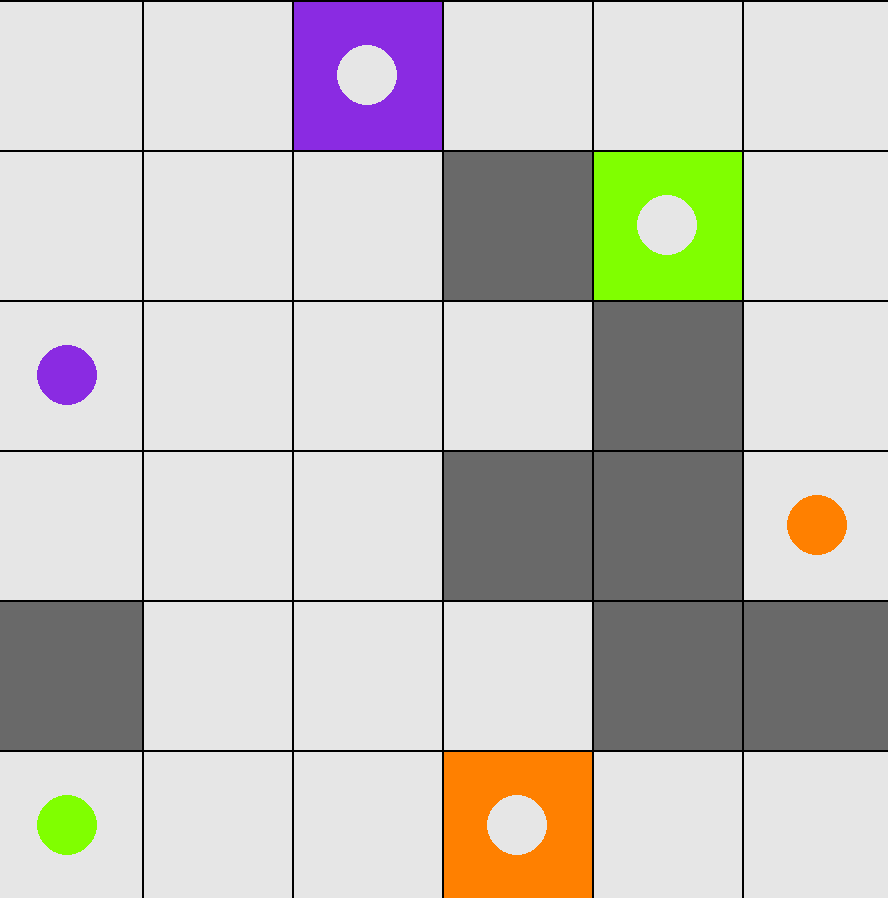

# Tiler-Slider Simulator

Simulator for tiler slider game for given input and set of output moves.

# Run

`pip3 install -r requirements.txt`

```
python3 __main__.py -input_file <file containing input grid> --moves_file <file containing corresponding moves>
eg: python3 __main__.py --input-file test_files/sample_grid_1.txt --moves-file test_files/sample_moves_1.txt
```

# Display

]
